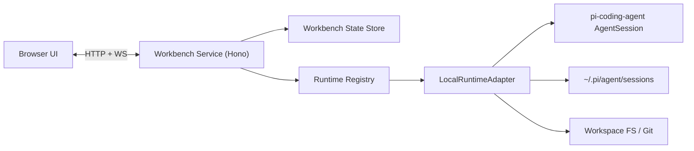
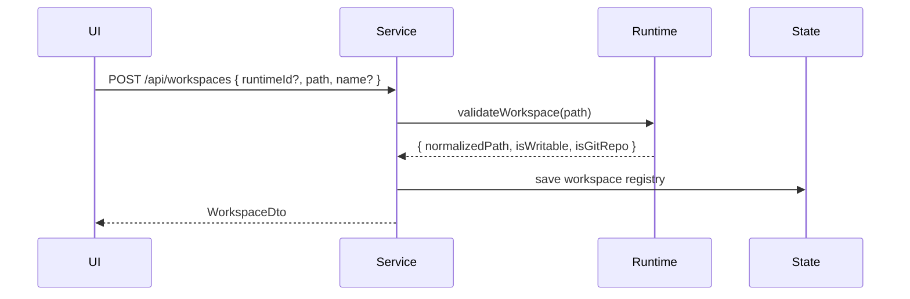
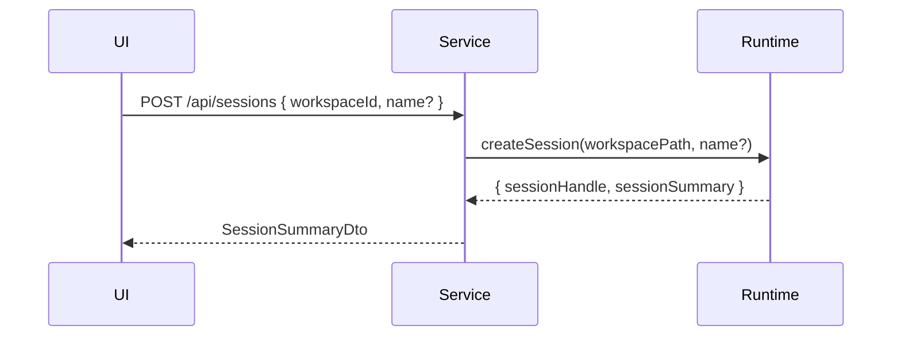
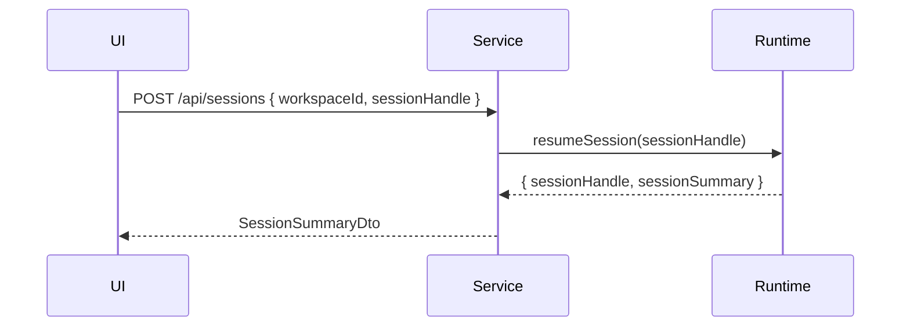
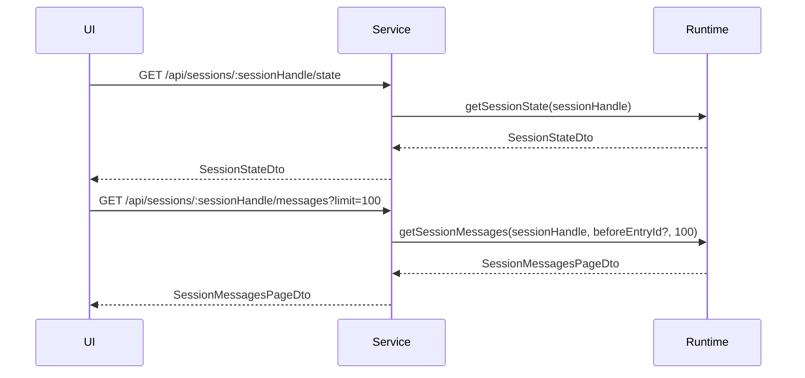
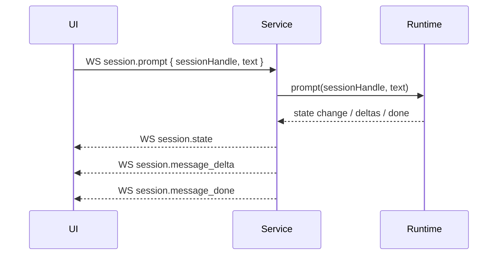
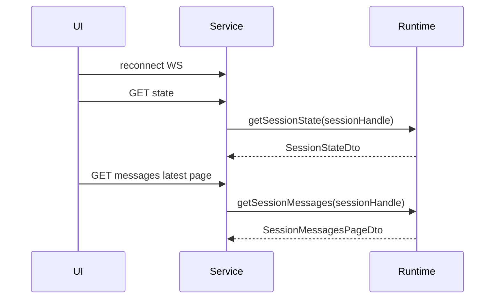

# Pi Web Workbench Architecture

## Goal

这份文档补充 `Pi Web Workbench MVP` 的实现级设计，目标是把以下内容定义清楚：

- 整体架构分层
- 浏览器、Workbench Service、Agent Runtime 之间的数据流
- `AgentRuntime` 核心接口
- Hono 服务层组织方式
- HTTP / WebSocket DTO
- 本地 runtime 的默认实现边界

本文档默认沿用以下前提：

- MVP 只实现 `LocalRuntimeAdapter`
- Web 层不直接依赖本地文件系统和 `.pi` session 文件格式
- agent 运行态以 `pi-coding-agent` 暴露的 `AgentState` 为准
- session 在 Web 层使用 `sessionHandle`，消息在传输层使用 `entryId`

## Architecture

### High-Level



### Responsibilities

#### Browser UI

- 展示 workspace、session、消息、Git changes
- 维护 UI 状态，例如当前 active session、drawer 开关、WS 连接状态
- 通过 HTTP 拉取快照和历史
- 通过 WS 接收实时事件

#### Workbench Service

- 使用 `Hono` 提供 HTTP API
- 提供单一 WebSocket 接入点
- 管理浏览器会话、订阅关系、runtime 路由
- 管理私有状态存储，例如 workspace registry、最近使用、UI 恢复状态
- 将 runtime 返回的数据规范化为 Web DTO

#### AgentRuntime

- 屏蔽 agent 运行位置差异
- 提供 workspace、session、Git、消息读取等语义能力
- 负责把底层 agent 事件转换为统一事件流

#### LocalRuntimeAdapter

- 基于本地 `createAgentSession`、`SessionManager`、本地 Git、文件系统实现 `AgentRuntime`
- 管理活跃 session 实例
- 读取 `.pi` session 文件
- 将 `AgentState` / `AgentEvent` 适配为 Web 层 DTO

#### Workbench State Store

- 私有状态文件，例如 `~/.pi-web/state.json`
- 不是 session 真相源
- 只保存：
  - `schemaVersion`
  - workspaces
  - 最近使用时间
  - UI 恢复状态

## Hono Service Design

### Why Hono

- 路由和中间件足够轻
- 适合把 HTTP 和 WebSocket 接入整理成小而清晰的模块
- 类型定义友好，适合把 DTO 和 handler 绑定在一起
- 后续如果要拆 adapter 或切运行环境，迁移成本相对低

### Suggested Module Layout

```text
src/
  server/
    app.ts
    context.ts
    ws.ts
    errors.ts
    dto.ts
  routes/
    workspaces.ts
    sessions.ts
    git.ts
    health.ts
  services/
    workspace-service.ts
    session-service.ts
    git-service.ts
    subscription-service.ts
  runtime/
    agent-runtime.ts
    runtime-registry.ts
    local-runtime-adapter.ts
    runtime-types.ts
  state/
    state-store.ts
    state-schema.ts
  utils/
    path-safety.ts
    cursors.ts
```

### Hono App Composition

```ts
import { Hono } from "hono";

export function createApp(deps: AppDeps) {
  const app = new Hono<AppEnv>();

  app.route("/api/workspaces", createWorkspacesRoutes(deps));
  app.route("/api/sessions", createSessionsRoutes(deps));
  app.route("/api/git", createGitRoutes(deps));
  app.get("/ws", upgradeWebSocket(deps));

  return app;
}
```

### Service Layer Rule

- Hono route handler 只做：
  - 请求解析
  - DTO 校验
  - 调 service
  - 错误映射
- 业务逻辑不写进 route handler
- runtime 调用只出现在 service / runtime 层

### Hono Request Validation Rule

- 每个 route 都有显式 request DTO
- 进入 service 层前必须完成 schema 校验
- 解析失败统一返回 `400` + `ErrorDto`
- 不接受“透传任意 JSON 到 runtime”的 handler

## Core Concepts

### RuntimeId

`runtimeId` 标识一个 agent 执行面实例。

- MVP 固定只有一个：`local`
- 远期可扩展为：
  - `local`
  - `remote-macbook`
  - `remote-linux-box`

### WorkspaceId

`workspaceId` 是 Workbench Service 私有标识。

- 一个 workspace 绑定一个 `runtimeId`
- 同一路径在不同 runtime 上必须视为不同 workspace

### SessionHandle

`sessionHandle` 是 Web 层稳定会话标识。

- 不要求等于底层 `sessionId`
- 必须足以让 service 找到目标 runtime 和 session
- 推荐格式：

```txt
<runtimeId>:<sessionId>
```

也可以做成 opaque string，只要服务端可反解即可。

### EntryId

`entryId` 是 session 中单条持久化 entry 的稳定 ID。

- 用于消息分页
- 用于 HTTP 与 WS 对齐
- 来自底层 session entry，而不是前端生成

### StreamingMessageId

`streamingMessageId` 是单次流式输出期间的临时标识。

- 只在 WS streaming 阶段有效
- `message_done` 到来后，由稳定 `entryId` 接管

## Core Data Flow

### 1. Register Workspace



### 2. Create Session



### 3. Resume Session



### 4. Load Session Screen



### 5. Prompt + Stream



### 6. Reconnect



约束：

- 重连后不做 WS replay
- HTTP 负责最终一致
- WS 只负责新的实时增量

## AgentRuntime Interface

```ts
export interface AgentRuntime {
  readonly runtimeId: string;

  validateWorkspace(inputPath: string): Promise<WorkspaceValidationResult>;

  listSessions(input: ListSessionsInput): Promise<ListSessionsResult>;

  createSession(input: CreateSessionInput): Promise<CreateSessionResult>;

  resumeSession(input: ResumeSessionInput): Promise<ResumeSessionResult>;

  getSessionState(input: GetSessionStateInput): Promise<SessionStateDto>;

  getSessionMessages(input: GetSessionMessagesInput): Promise<SessionMessagesPageDto>;

  prompt(input: PromptInput): Promise<void>;

  abort(input: AbortInput): Promise<void>;

  getGitChanges(input: GetGitChangesInput): Promise<GitChangesDto>;

  getGitDiff(input: GetGitDiffInput): Promise<GitDiffDto>;

  subscribe(listener: RuntimeEventListener): () => void;
}
```

### Runtime Results

```ts
export interface WorkspaceValidationResult {
  normalizedPath: string;
  isDirectory: boolean;
  isWritable: boolean;
  isGitRepo: boolean;
}

export interface ListSessionsResult {
  items: SessionSummaryDto[];
  nextCursor?: string;
}

export interface CreateSessionResult {
  session: SessionSummaryDto;
}

export interface ResumeSessionResult {
  session: SessionSummaryDto;
}
```

### Runtime Inputs

```ts
export interface ListSessionsInput {
  workspacePath: string;
  cursor?: string;
  limit: number;
}

export interface CreateSessionInput {
  workspacePath: string;
  name?: string;
}

export interface ResumeSessionInput {
  sessionHandle: string;
}

export interface GetSessionStateInput {
  sessionHandle: string;
}

export interface GetSessionMessagesInput {
  sessionHandle: string;
  beforeEntryId?: string;
  limit: number;
}

export interface PromptInput {
  sessionHandle: string;
  text: string;
}

export interface AbortInput {
  sessionHandle: string;
}

export interface GetGitChangesInput {
  workspacePath: string;
}

export interface GetGitDiffInput {
  workspacePath: string;
  relativePath: string;
}
```

### Runtime Events

```ts
export type RuntimeEvent =
  | {
      type: "session.started";
      sessionHandle: string;
    }
  | {
      type: "session.state";
      sessionHandle: string;
      state: SessionStateDto;
    }
  | {
      type: "session.message_delta";
      sessionHandle: string;
      turnIndex: number;
      streamingMessageId: string;
      delta: string;
    }
  | {
      type: "session.message_done";
      sessionHandle: string;
      turnIndex: number;
      entryId: string;
      message: SessionMessageDto;
    }
  | {
      type: "session.error";
      sessionHandle: string;
      error: ErrorDto;
    };

export type RuntimeEventListener = (event: RuntimeEvent) => void;
```

## Core DTO

### HTTP Request DTO

```ts
export interface CreateWorkspaceRequestDto {
  runtimeId?: string;
  path: string;
  name?: string;
}

export interface CreateOrResumeSessionRequestDto {
  workspaceId: string;
  sessionHandle?: string;
  name?: string;
}

export interface SessionMessagesQueryDto {
  beforeEntryId?: string;
  limit?: number;
}

export interface SessionListQueryDto {
  cursor?: string;
  limit?: number;
}
```

### Workspace DTO

```ts
export interface WorkspaceDto {
  workspaceId: string;
  runtimeId: string;
  path: string;
  name?: string;
  isGitRepo: boolean;
  lastUsedAt?: string;
}
```

### Session Summary DTO

```ts
export interface SessionSummaryDto {
  sessionHandle: string;
  sessionId: string;
  runtimeId: string;
  workspacePath: string;
  sessionFile?: string;
  sessionName?: string;
  createdAt: string;
  updatedAt: string;
  lastMessagePreview?: string;
}
```

### Session State DTO

```ts
export interface SessionStateDto {
  sessionHandle: string;
  model?: {
    provider: string;
    id: string;
    displayName?: string;
  };
  thinkingLevel?: string;
  isStreaming: boolean;
  pendingToolCalls: string[];
  error?: string;
}
```

说明：

- 上述字段严格对应 `AgentState` 的可传输子集
- `Set` 类型在传输层全部转数组
- 不把底层完整 `Model` 对象直接透出到 Web

### Message DTO

```ts
export interface SessionMessageDto {
  entryId: string;
  parentEntryId?: string | null;
  timestamp: string;
  role:
    | "user"
    | "assistant"
    | "toolResult"
    | "bashExecution"
    | "custom"
    | "branchSummary"
    | "compactionSummary";
  content: unknown;
  meta?: {
    toolName?: string;
    toolCallId?: string;
    isError?: boolean;
    stopReason?: string;
    model?: string;
    provider?: string;
  };
}
```

### Messages Page DTO

```ts
export interface SessionMessagesPageDto {
  sessionHandle: string;
  items: SessionMessageDto[];
  nextBeforeEntryId?: string;
}
```

### Git DTO

```ts
export interface GitChangeItemDto {
  path: string;
  status: "modified" | "added" | "deleted" | "untracked";
  isBinary?: boolean;
}

export interface GitChangesDto {
  workspaceId: string;
  items: GitChangeItemDto[];
}

export interface GitDiffDto {
  workspaceId: string;
  path: string;
  isBinary: boolean;
  tooLarge: boolean;
  diffText?: string;
}
```

### HTTP Response Envelope

```ts
export interface OkResponseDto<T> {
  ok: true;
  data: T;
}

export interface ErrorResponseDto {
  ok: false;
  error: ErrorDto;
}
```

### Error DTO

```ts
export interface ErrorDto {
  code:
    | "workspace_not_found"
    | "workspace_invalid"
    | "session_not_found"
    | "session_busy"
    | "runtime_unavailable"
    | "git_unavailable"
    | "path_out_of_workspace"
    | "internal_error";
  message: string;
}
```

## WebSocket Event DTO

### Client -> Service

```ts
export type ClientWsEvent =
  | {
      type: "session.prompt";
      sessionHandle: string;
      text: string;
    }
  | {
      type: "session.abort";
      sessionHandle: string;
    };
```

### Service -> Client

```ts
export type ServerWsEvent =
  | {
      type: "session.started";
      sessionHandle: string;
    }
  | {
      type: "session.state";
      sessionHandle: string;
      state: SessionStateDto;
    }
  | {
      type: "session.message_delta";
      sessionHandle: string;
      turnIndex: number;
      streamingMessageId: string;
      delta: string;
    }
  | {
      type: "session.message_done";
      sessionHandle: string;
      turnIndex: number;
      entryId: string;
      message: SessionMessageDto;
    }
  | {
      type: "session.tool_started";
      sessionHandle: string;
      toolCallId: string;
      toolName: string;
      args: unknown;
    }
  | {
      type: "session.tool_updated";
      sessionHandle: string;
      toolCallId: string;
      toolName: string;
      partialResult: unknown;
    }
  | {
      type: "session.tool_finished";
      sessionHandle: string;
      toolCallId: string;
      toolName: string;
      entryId?: string;
      message?: SessionMessageDto;
    }
  | {
      type: "session.error";
      sessionHandle: string;
      error: ErrorDto;
    };
```

## LocalRuntimeAdapter Mapping

### Session Listing

- 通过 `SessionManager.list(cwd)` 枚举某个 workspace 的 session
- 通过 `SessionManager.listAll()` 做全量扫描或恢复辅助
- 将返回的 `SessionInfo` 转成 `SessionSummaryDto`

### Session State

- 活跃 session 直接读取 `AgentSession.state`
- 非活跃 session：
  - 不虚构运行中状态
  - 返回一个基于持久化数据和默认值构造的静态 `SessionStateDto`
  - `isStreaming = false`
  - `pendingToolCalls = []`
- service 重启后：
  - 不自动恢复之前的活跃内存 session 实例
  - 所有 session 先按非活跃静态状态暴露
  - 用户重新打开或继续会话时，再懒创建活跃 runtime 实例

### Message Pagination

- 从当前 resolved branch 读取 message entries
- 按时间倒序切片
- 输出 `beforeEntryId` 游标

### Git

- runtime 自己校验路径边界
- 只允许 workspace 内相对路径
- 二进制文件和大 diff 做降级

## Branch Semantics

MVP 不做 tree UI，但必须固定语义：

- session 总是面向“当前 leaf”
- 消息列表返回的是从 root 到当前 leaf 的 resolved branch
- 继续会话时，新消息追加到当前 leaf
- 如果未来支持 tree 切换，再显式引入 `leafId` 选择能力

## Pagination Semantics

### Session List

- 默认按 `updatedAt desc`
- `cursor` 是服务端不透明游标
- 前端只做“加载更多”，不参与排序计算

### Messages

- 默认读取最近 `N` 条
- 使用 `beforeEntryId` 向前翻页
- 如果 `beforeEntryId` 不存在，返回 `session_not_found` 或 `internal_error` 之外的明确错误

## HTTP Semantics

- 所有 HTTP 接口统一使用 `OkResponseDto<T> | ErrorResponseDto`
- route handler 不返回裸 DTO
- 前端统一在 transport 层解包 `data`

## Path Safety

所有 workspace 内路径型接口都遵守以下规则：

- 输入必须是相对路径
- service 不做字符串拼接式信任
- runtime 必须做：
  - `normalize`
  - `resolve`
  - workspace root boundary check
- 越界时返回 `path_out_of_workspace`

## Implementation Notes

### What Stays Out of MVP

- 远端 runtime
- WS replay
- terminal
- session tree 可视化
- steer / follow-up
- session files tracking

### What Must Stay Stable

- `sessionHandle`
- `entryId`
- `SessionStateDto`
- `SessionMessageDto`
- `AgentRuntime` 接口语义

这些是后续从本地 runtime 演进到 remote runtime 时最不应该返工的边界。
