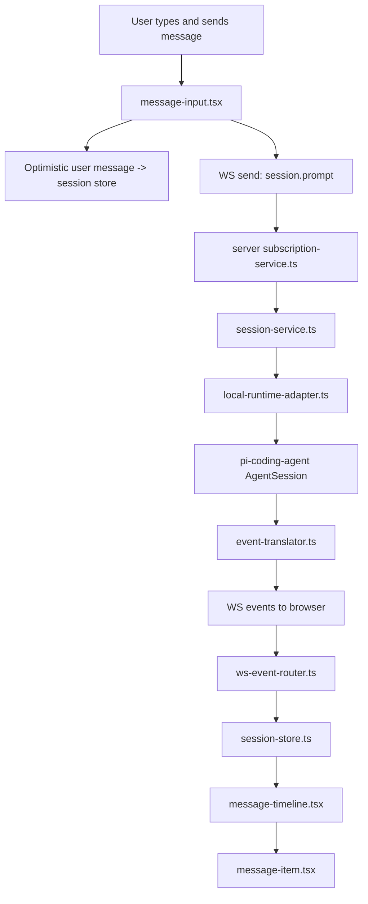
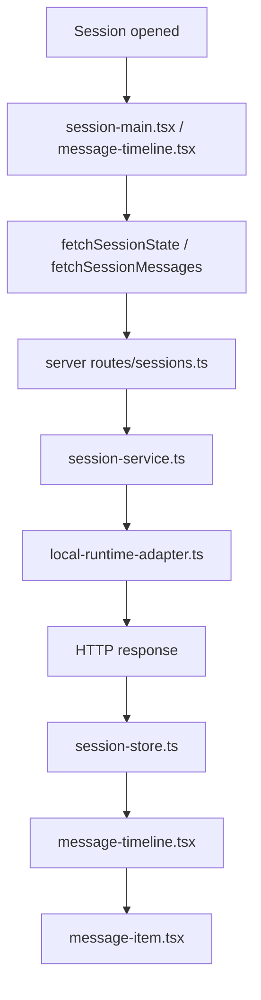

# Pi Web Message Rendering Handoff

## Goal

这份文档用于给后续接手的模型 / 开发者一个**快速、完整、可落地**的 message 渲染实现说明。

目标是回答这些问题：

- message 在前端到底是怎么渲染出来的？
- 数据从哪里来？REST、WebSocket、store 各自负责什么？
- streaming、tool draft、optimistic user message 分别走哪条链路？
- 如果要修改 assistant / tool / markdown / timeline / history 行为，应该看哪些文件？

本文聚焦当前仓库里的真实实现，而不是抽象设计稿。

---

## TL;DR

如果你只想先抓主线，优先看这几个文件：

### 最重要的前端文件

1. `packages/web/src/features/sessions/message-timeline.tsx`
   - 消息列表入口
   - 历史加载
   - turn 分组
   - tool draft / streaming draft 渲染
   - 滚动与分页

2. `packages/web/src/features/sessions/message-item.tsx`
   - 单条消息渲染核心
   - 按 role 分发 UI
   - assistant markdown 渲染
   - tool 面板渲染
   - code block copy

3. `packages/web/src/app/ws-event-router.ts`
   - WebSocket 事件如何进入前端 store
   - `streamingDraft` / `toolDrafts` / `messages` 的更新逻辑

4. `packages/web/src/features/sessions/composer/message-input.tsx`
   - 发送消息
   - optimistic user message

### 最重要的后端文件

1. `packages/server/src/runtime/event-translator.ts`
   - SDK 事件如何转成前端可消费的 WS 事件 / `SessionMessageDto`

2. `packages/server/src/runtime/local-runtime-adapter.ts`
   - 当前 runtime 如何发出状态、消息、工具事件
   - `getSessionMessages()` / `prompt()` / `emitState()` 的上下文

3. `packages/server/src/services/subscription-service.ts`
   - WebSocket message 路由入口

4. `packages/server/src/routes/sessions.ts`
   - 前端拉历史 / 拉状态 / abort 的 HTTP 接口

---

## 仓库范围

message 渲染相关逻辑主要分布在：

```text
packages/web/src/
packages/server/src/
docs/
```

当前实现是一个前后端同仓 monorepo：

- `packages/web`: 浏览器 UI
- `packages/server`: Hono + WebSocket + runtime adapter

---

## 核心概念

理解这几个对象后，整条链路会清晰很多。

### 1. `SessionMessageDto`

前后端共享的消息 DTO 结构。

定义：

- `packages/web/src/types/dto.ts`
- `packages/server/src/runtime/runtime-types.ts`

关键字段：

- `entryId`: 持久化消息的稳定 ID
- `timestamp`
- `role`
- `content`
- `meta`

支持的主要 role：

- `user`
- `assistant`
- `toolResult`
- `bashExecution`
- `branchSummary`
- `compactionSummary`

### 2. `streamingDraft`

前端 store 中用于渲染**流式 assistant 临时文本**的对象。

定义：

- `packages/web/src/app/store/session-store.ts`

特点：

- 在 `session.message_delta` 时不断累加文本
- 在 `session.message_done` 后被清空
- 只用于 UI 过渡，不是持久化消息真相源

### 3. `toolDrafts`

前端 store 中用于渲染**工具调用过程中的临时消息**。

定义：

- `packages/web/src/app/store/session-store.ts`

来源：

- `session.tool_started`
- `session.tool_updated`
- `session.tool_finished`

### 4. `entryId` vs `streamingMessageId`

- `entryId`: 稳定、持久化、历史分页使用
- `streamingMessageId`: assistant 正在流式输出时的临时 ID

`streamingMessageId` 最终会被真实 `entryId` 替代。

### 5. REST 是历史真相，WS 是实时增量

当前实现的一个非常重要的原则：

- **REST** 负责拉取历史 / 权威快照
- **WS** 负责实时增量更新
- 前端会做去重与合并

尤其是：

- optimistic user message 会先显示
- assistant streaming 先显示 draft
- streaming 结束后可能 re-fetch messages，确保最终消息与 tool result 完整一致

---

## 整体路径总览



如果是历史加载路径：



---

## 前端渲染路径

## 1. 页面入口

文件：`packages/web/src/features/sessions/session-main.tsx`

职责：

- 渲染 session 页面主结构
- 在切换到某个 session 且没有 state 时，通过 WS 请求 `session.get_state`
- 挂载消息区 `MessageTimeline`
- 挂载输入区 `Composer`

关键点：

- `MessageTimeline` 是消息渲染入口
- `Composer` 是消息发送入口

---

## 2. 列表层：`MessageTimeline`

文件：`packages/web/src/features/sessions/message-timeline.tsx`

这是**消息列表真实渲染入口**。

### 它负责什么？

#### A. 从 store 取数据

从 `useSessionStore` 里读：

- `messages`
- `streamingDraft`
- `toolDrafts`
- `nextBeforeEntryId`
- `state.isStreaming`

#### B. 首次拉历史消息

通过：

- `fetchSessionMessages(activeHandle)`

文件：`packages/web/src/api/sessions.ts`

拉完后写回 `useSessionStore`。

#### C. 流式结束后 re-fetch

当 `isStreaming` 从 `true -> false` 时，会再次拉取历史消息，确保：

- tool result 完整
- optimistic / draft 状态被权威数据替换
- entryId 稳定化

#### D. 滚动与向上分页

- 维护 `scrollRef`
- 用户滚到顶部时，用 `nextBeforeEntryId` 拉更早历史
- 拉取后保持滚动位置稳定

#### E. turn 分组

内部函数：`groupIntoTurns(messages)`

规则：

- `role === "user"` 开一个新 turn
- 后续非 user 消息都归入这个 turn 的 `responses`

因此 UI 的结构更像：

- 一条用户消息
- 后面跟一组 assistant / tool 消息

#### F. 合成临时消息用于渲染

`MessageTimeline` 不只渲染持久化 `messages`，还会把：

- `toolDrafts` -> 临时 `toolResult` message
- `streamingDraft` -> 临时 `assistant` message

统一喂给渲染层。

#### G. 显示 `StreamingSpinner`

如果 session 正在 streaming，但当前既没有工具草稿，也没有 assistant draft 文本，就显示 spinner。

---

## 3. 单条消息渲染：`message-item.tsx`

文件：`packages/web/src/features/sessions/message-item.tsx`

这个文件是**message 的 UI 实现中心**。

它导出两个主组件：

- `UserMessage`
- `TimelineMessage`

### 3.1 `UserMessage`

用于渲染 `role === "user"`。

表现：

- 左侧气泡
- 带边框和背景
- 长文本支持折叠 / 展开
- 使用 `content-clamp`
- 外层是 `sticky top-0`，所以用户消息在时间线里有吸顶效果

### 3.2 `TimelineMessage`

用于渲染时间线里的非 user 消息。

表现：

- 左侧圆点
- 垂直连线
- 根据 message 类型决定 dot 颜色
- streaming 时 dot 会闪烁

内部继续调用：

- `TimelineContent`

---

## 4. role 分发逻辑

文件：`packages/web/src/features/sessions/message-item.tsx`

组件：`TimelineContent`

当前规则：

### `toolResult` / `bashExecution`

渲染到：

- `ToolPanel`

### `branchSummary` / `compactionSummary`

渲染成：

- 中间文字 + 两侧横线的 summary 分隔样式

### `assistant`

渲染到：

- `AssistantContent`

### 其它未知 role

fallback：

- 直接显示 `[role] ...`

---

## 5. assistant 渲染路径

文件：`packages/web/src/features/sessions/message-item.tsx`

组件：`AssistantContent`

### 处理逻辑

1. 把 `message.content` 归一化成字符串
2. 如果 `message.meta?.thinking` 存在，先渲染 `ThinkingBlock`
3. 正文通过 `react-markdown` 渲染
4. 如果是 streaming 中，末尾加闪烁光标

### markdown 渲染

使用：

- `react-markdown`
- `remark-gfm`

因此 assistant 内容支持 GFM 语法。

### code block 自定义

同文件中有：

- `CodeBlock`
- `CopyButton`
- `markdownComponents`

目前通过替换 markdown 的 `pre` 元素，为代码块加 copy 功能。

---

## 6. thinking 渲染路径

文件：`packages/web/src/features/sessions/message-item.tsx`

组件：`ThinkingBlock`

来源：

- `message.meta.thinking`

特点：

- 使用 `<details>` / `<summary>` 可折叠
- streaming 时显示 `Thinking...`
- 完成后显示估算思考时间文案

thinking 不是独立 message，而是 assistant message 的附属 meta 信息。

---

## 7. tool 渲染路径

文件：`packages/web/src/features/sessions/message-item.tsx`

主组件：`ToolPanel`

### `ToolPanel` 结构

- 第一行：工具名 + 次要文本（路径 / command）
- 第二行：补充描述（例如 edit/write 的 Added/Removed lines）
- 第三部分：工具 body

### `ToolBody` 分发

#### `read`

渲染成简单路径卡片。

#### `edit` / `write`

渲染到：

- `EditDiffBody`

特点：

- 内联 diff 风格
- 删除行 / 增加行分别着色
- 支持折叠 / 展开

#### 其它工具

渲染到：

- `DefaultToolBody`

特点：

- 参数用 grid 展示
- 结果内容单独展示
- 长内容可折叠

---

## 8. 样式来源

文件：`packages/web/src/styles/tokens.css`

message 相关样式重点看：

- `@keyframes timeline-dot-blink`
- `.content-clamp`
- `.markdown-root`
- `.markdown-root pre`
- `.markdown-root code`
- `.markdown-root table`
- `.markdown-root blockquote`

如果你想改：

- markdown 正文字体 / 间距 / blockquote / table / code 样式
- 折叠高度
- streaming dot 动画

先看这个文件。

---

## 前端数据流

## 9. session store 结构

文件：`packages/web/src/app/store/session-store.ts`

每个 session 主要维护：

- `summary`
- `state`
- `messages`
- `nextBeforeEntryId`
- `hasLoadedInitialPage`
- `streamingDraft`
- `toolDrafts`

### `setSession()` 的重要行为

`setSession()` 不是简单覆盖，而是做 merge，并且：

- 如果 patch 没传 `messages`，保留原 messages
- 如果 patch 没传 `toolDrafts`，保留原 toolDrafts
- 如果 patch 没显式包含 `streamingDraft`，保留原 streamingDraft

这意味着：

- 很多更新是局部 patch
- 调用方必须清楚哪些字段会被保留，哪些会被覆盖

---

## 10. 初始连接与重连恢复

文件：`packages/web/src/app/hooks/use-app-init.ts`

职责：

- 初始化 WebSocket 连接
- 在 reconnect 后重新拉当前 active session 的 state + messages
- 把 REST 历史和 WS 已到达消息去重合并

关键原则：

- reconnect 后使用 REST 快照重新建立权威状态
- 清空 `streamingDraft` / `toolDrafts`

---

## 11. WebSocket 事件如何进入 store

文件：`packages/web/src/app/ws-event-router.ts`

这是实时消息进入 UI 的核心路由器。

### `session.state`

更新：

- `state`
- 当 streaming 结束时清空 `toolDrafts` / `streamingDraft`

### `session.message_delta`

更新：

- `streamingDraft`

逻辑：

- 如果是同一个 `streamingMessageId`，继续拼接文本
- 否则创建新的 assistant draft

### `session.message_done`

更新：

- 把最终 assistant message 放入 `messages`
- 清掉 `streamingDraft`
- 清理已完成 tool draft

### `session.tool_started`

更新：

- 新增 / 替换某个 `toolDraft`

### `session.tool_updated`

更新：

- 更新 `toolDraft.partialResult`

### `session.tool_finished`

两种情况：

1. 服务端带回最终 `message`
   - 移除 draft
   - 将 tool message 写入 `messages`

2. 没有最终 `message`
   - 仅把 draft 标记成 done

### `session.error`

更新：

- `state.error`

---

## 12. 发送消息与 optimistic user message

文件：`packages/web/src/features/sessions/composer/message-input.tsx`

### 发送流程

1. 从编辑器提取文本
2. 在前端 store 里先插入一条 optimistic user message
3. 通过 WS 发送 `session.prompt`
4. 清空输入框

optimistic message 的 ID 形如：

```text
optimistic:<uuid>
```

### 为什么这样做？

因为后端不会在 WS 里实时发用户消息，当前策略是：

- 用户消息先本地乐观显示
- 后续由 REST 历史重新拉取权威版本替换

这是当前实现里的关键设计点。

---

## 后端数据流

## 13. HTTP 接口入口

文件：`packages/server/src/routes/sessions.ts`

当前 message 渲染相关最重要的接口：

- `GET /api/sessions/:sessionHandle/state`
- `GET /api/sessions/:sessionHandle/messages`
- `POST /api/sessions/:sessionHandle/abort`
- `POST /api/sessions`

前端对应调用封装在：

- `packages/web/src/api/sessions.ts`

---

## 14. WebSocket 入口

文件：`packages/server/src/main.ts`

这里：

- 创建 `SubscriptionService`
- 把 runtime event 广播给 WS 客户端
- 把客户端 WS message 交给 `subscriptionService.handleClientMessage()`

客户端连接地址：

- `packages/web/src/app/ws-instance.ts`
- `packages/web/src/api/ws.ts`

---

## 15. WS client message 路由

文件：`packages/server/src/services/subscription-service.ts`

它负责解析客户端发来的 WS 消息：

- `session.prompt`
- `session.abort`
- `session.list_models`
- `session.get_state`
- `session.set_model`
- `session.set_thinking_level`

其中 message 渲染主链路最相关的是：

- `session.prompt`
- `session.get_state`
- runtime event 广播

---

## 16. SessionService 中转层

文件：`packages/server/src/services/session-service.ts`

这是 route / subscription service 到 runtime 之间的薄中转层。

message 相关主要方法：

- `getSessionState()`
- `getSessionMessages()`
- `prompt()`
- `abort()`

---

## 17. runtime adapter

文件：`packages/server/src/runtime/local-runtime-adapter.ts`

这是当前后端 message 生命周期里最重要的实现文件之一。

### 它负责什么？

- 创建 / 恢复 `AgentSession`
- 读取历史消息
- 发 prompt
- 监听 SDK event
- 把 SDK event 通过 `translateEvent()` 转成前端事件
- 发送 `session.state`

### 你应该重点看这些方法

- `getSessionState()`
- `getSessionMessages()`
- `prompt()`
- `emitState()`
- `createActiveSession()`

### 特别注意

在 `createActiveSession()` 里，runtime 会订阅 SDK session：

- SDK event -> `translateEvent()` -> RuntimeEvent -> WS 广播

这是 assistant streaming 和 tool draft 的后端起点。

---

## 18. SDK event -> 前端 message DTO

文件：`packages/server/src/runtime/event-translator.ts`

这是**消息形态转换的核心文件**。

### 关键职责

#### A. 把 SDK 事件翻译成 WS 事件

包括：

- `session.message_delta`
- `session.message_done`
- `session.tool_started`
- `session.tool_updated`
- `session.tool_finished`

#### B. 管理翻译过程中的状态

通过 `TranslatorState` 跟踪：

- `turnIndex`
- `streamingMessageId`
- `pendingToolArgs`

#### C. 生成 `SessionMessageDto`

函数：`agentMessageToDto()`

这个函数会：

- 提取 assistant 的 text block
- 提取 thinking block 到 `meta.thinking`
- 识别 tool 元信息到 `meta.toolName` / `meta.toolCallId` / `meta.toolArgs`
- 处理 error / stopReason / provider / model 元数据

#### D. 处理 tool result 内容

函数：`extractToolResultContent()`

把 SDK 的工具结果统一转成前端可显示的字符串内容。

---

## 历史 + 实时 合并策略

这是当前实现里最容易误判的地方。

## 19. 为什么会同时有 REST、WS、optimistic、draft？

因为四类数据分别解决不同问题：

### REST `fetchSessionMessages()`

解决：

- 历史加载
- reconnect 恢复
- 流式结束后拿到权威持久化消息
- 获取 WS 可能不会完整给出的 tool result

### WS `session.message_delta`

解决：

- assistant 流式文本实时展示

### WS `session.tool_*`

解决：

- 工具调用过程中的实时反馈

### optimistic user message

解决：

- 用户发送后立刻可见

---

## 20. 去重策略

主要发生在：

- `packages/web/src/features/sessions/message-timeline.tsx`
- `packages/web/src/app/hooks/use-app-init.ts`

基本思路：

- REST page 作为 authoritative base
- 追加那些 REST page 里还没有的 WS-only 消息
- 丢弃 `optimistic:` 前缀的本地临时消息，等待真实历史替换

如果你要改消息来源策略，这两处必须一起看。

---

## 渲染问题定位指南

## 21. 想改 assistant 文本样式，看哪里？

优先看：

- `packages/web/src/features/sessions/message-item.tsx`
  - `AssistantContent`
- `packages/web/src/styles/tokens.css`
  - `.markdown-root`
  - `pre` / `code` / `blockquote` / `table`

---

## 22. 想改用户消息样式，看哪里？

优先看：

- `packages/web/src/features/sessions/message-item.tsx`
  - `UserMessage`

---

## 23. 想改时间线圆点 / 竖线 / streaming 效果，看哪里？

优先看：

- `packages/web/src/features/sessions/message-item.tsx`
  - `TimelineMessage`
  - `getDotColor()`
- `packages/web/src/styles/tokens.css`
  - `timeline-dot-blink`

---

## 24. 想改 tool 卡片展示，看哪里？

优先看：

- `packages/web/src/features/sessions/message-item.tsx`
  - `ToolPanel`
  - `ToolBody`
  - `EditDiffBody`
  - `DefaultToolBody`
  - `ToolResultContent`

---

## 25. 想改 markdown / code block copy，看哪里？

优先看：

- `packages/web/src/features/sessions/message-item.tsx`
  - `CodeBlock`
  - `CopyButton`
  - `markdownComponents`
- `packages/web/src/styles/tokens.css`

---

## 26. 想改 streaming 行为，看哪里？

优先看：

- 前端：
  - `packages/web/src/app/ws-event-router.ts`
  - `packages/web/src/features/sessions/message-timeline.tsx`
- 后端：
  - `packages/server/src/runtime/event-translator.ts`
  - `packages/server/src/runtime/local-runtime-adapter.ts`

---

## 27. 想改历史分页 / 重连恢复，看哪里？

优先看：

- `packages/web/src/features/sessions/message-timeline.tsx`
- `packages/web/src/app/hooks/use-app-init.ts`
- `packages/web/src/api/sessions.ts`
- `packages/server/src/routes/sessions.ts`
- `packages/server/src/runtime/local-runtime-adapter.ts`

---

## 推荐阅读顺序

如果一个新模型需要快速接手，建议按这个顺序阅读：

### 第 1 轮：只看渲染主线

1. `packages/web/src/features/sessions/session-main.tsx`
2. `packages/web/src/features/sessions/message-timeline.tsx`
3. `packages/web/src/features/sessions/message-item.tsx`
4. `packages/web/src/app/store/session-store.ts`
5. `packages/web/src/app/ws-event-router.ts`

### 第 2 轮：补足发送与恢复链路

6. `packages/web/src/features/sessions/composer/message-input.tsx`
7. `packages/web/src/app/hooks/use-app-init.ts`
8. `packages/web/src/api/sessions.ts`
9. `packages/web/src/styles/tokens.css`

### 第 3 轮：补足后端来源

10. `packages/server/src/routes/sessions.ts`
11. `packages/server/src/services/subscription-service.ts`
12. `packages/server/src/services/session-service.ts`
13. `packages/server/src/runtime/local-runtime-adapter.ts`
14. `packages/server/src/runtime/event-translator.ts`
15. `packages/server/src/runtime/runtime-types.ts`

---

## 关键设计结论

### 1. 渲染入口不是单点，而是两层

- 列表层：`message-timeline.tsx`
- 单项层：`message-item.tsx`

### 2. 当前 message UI 不是纯 REST，也不是纯 WS

而是：

- REST 快照
- WS 增量
- optimistic user message
- transient drafts

混合驱动。

### 3. assistant 与 user 渲染路径完全不同

- `user` -> `UserMessage`
- `assistant` / `toolResult` 等 -> `TimelineMessage`

### 4. thinking 不是单独一条消息

它是 assistant message 的 `meta.thinking`。

### 5. tool result 在 UI 上已经高度定制

尤其：

- `read`
- `edit` / `write`
- generic tool

已经分成不同 body renderer。

### 6. 流式结束后 re-fetch 是当前一致性策略的重要组成部分

不要轻易删掉，否则很容易出现：

- optimistic user message 残留
- tool result 不完整
- entryId 不稳定
- WS / REST 内容不一致

---

## 一句话总结

当前 message 系统的真实链路是：

> `message-input.tsx` 负责发送和 optimistic user message，`event-translator.ts` 负责把 SDK event 转成前端消息事件，`ws-event-router.ts` 负责把实时事件写入 store，`message-timeline.tsx` 负责把历史消息 + drafts 组织成时间线，`message-item.tsx` 负责按 role 渲染最终 UI。

如果你要改 message 体验，通常都要同时评估：

- DTO 结构
- WS 事件
- session store
- timeline 组织方式
- 单条消息 renderer
- 样式文件

不能只改其中一个点。
